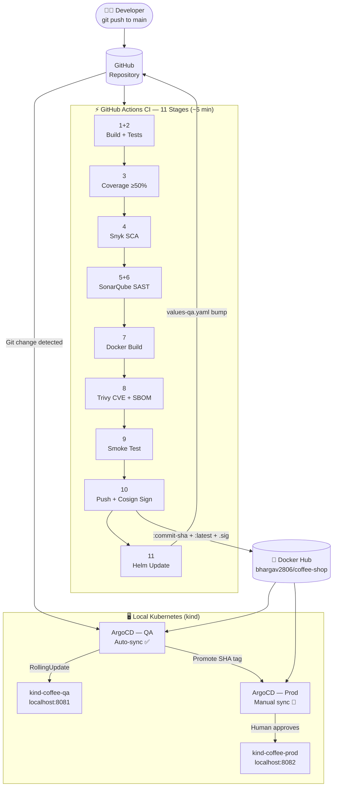
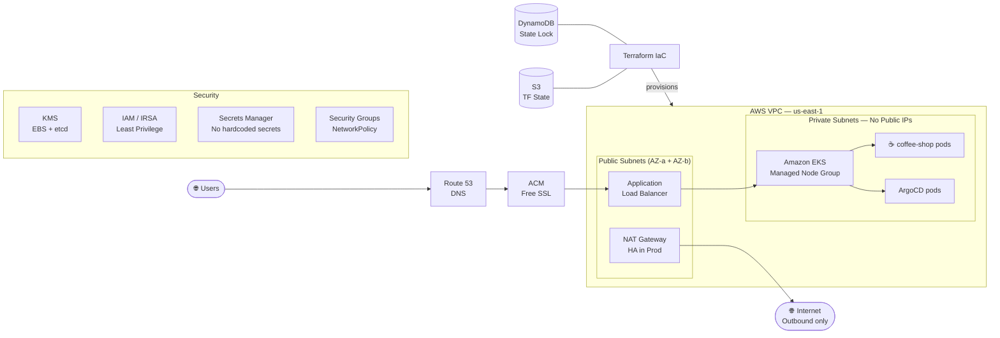

# ☕ The London Brew — Coffee Shop

> A full-stack DevSecOps portfolio project demonstrating a production-grade secure CI/CD pipeline, GitOps deployment, and cloud-native infrastructure — built on a React + Node.js coffee shop app.

[](https://github.com/Bhargav-2806/coffee-shop/actions/workflows/ci.yml)
[](https://hub.docker.com/r/bhargav2806/coffee-shop)
[](https://slsa.dev)
[](https://docs.sigstore.dev/cosign/overview/)
[](https://nodejs.org)
[](https://react.dev)
[](https://www.typescriptlang.org)
[](https://argoproj.github.io/cd/)

---

## What Is This Project?

**The London Brew** is a coffee shop web app — but the app itself is intentionally simple. The point of this repository is the **DevSecOps pipeline wrapped around it**.

Every commit to `main` triggers an 11-stage CI pipeline that builds, tests, scans for vulnerabilities, signs the image, and deploys it to a local Kubernetes cluster via ArgoCD — automatically. The same pipeline is designed to deploy to **AWS EKS** via Terraform.

This project demonstrates:

- **Shift-left security** — vulnerabilities caught at build time, not in production
- **Supply chain security** — every image is cryptographically signed (Cosign, SLSA Level 2)
- **GitOps** — Git is the single source of truth; ArgoCD reconciles cluster state
- **Immutable infrastructure** — containers are never patched, always rebuilt
- **Least privilege** — every CI job, pod, and cloud resource gets only what it needs

---

## Architecture

### CI/CD Pipeline → GitOps → Kubernetes



### AWS Target Architecture (via Terraform)



---

## Tech Stack

### Application

| Layer | Technology |
|-------|-----------|
| Frontend | React 19 · TypeScript · Vite · Tailwind CSS v4 |
| Backend | Node.js 20 · Express 4 · ES Modules |
| Testing | Vitest · Testing Library · Supertest |
| Container | Docker (multi-stage) · Alpine Linux · ~61 MB image |

### DevSecOps Toolchain

| Category | Tool | Purpose |
|----------|------|---------|
| CI/CD | GitHub Actions | 11-stage automated pipeline |
| SCA | Snyk | Dependency vulnerability scanning |
| SAST | SonarQube 9.9 | Static code analysis + quality gate |
| Container Scan | Trivy | CVE scanning + SBOM generation |
| Image Signing | Cosign (keyless) | Supply chain security · SLSA Level 2 |
| Registry | Docker Hub | Image storage · 3 tags per build |
| Packaging | Helm | Kubernetes manifest templating |
| GitOps | ArgoCD | Continuous delivery · drift detection |
| Orchestration | Kubernetes (kind) | Local clusters · QA + Prod |
| IaC | Terraform | AWS VPC + EKS + IAM + KMS |
| Cloud | AWS EKS | Target production platform |

---

## Quick Start — Run Locally

**Prerequisites:** Node.js 20+

```bash
# 1. Clone the repo
git clone https://github.com/Bhargav-2806/coffee-shop.git
cd coffee-shop

# 2. Install dependencies
npm install

# 3. Start development server (React + Express)
npm run dev
```

Open **http://localhost:3000**

### Other commands

```bash
npm run build          # TypeScript check + Vite production build
npm test               # Run Vitest unit tests
npm run test:coverage  # Run tests with coverage report
npm run lint           # TypeScript type check only
```

---

## Run with Docker

```bash
# Build the image
docker build -t coffee-shop:local .

# Run in production mode
docker run -p 3000:3000 -e NODE_ENV=production coffee-shop:local

# Or use Docker Compose (includes health check)
docker compose up
```

Pull the latest image from Docker Hub:

```bash
docker pull bhargav2806/coffee-shop:latest

# Verify the Cosign signature before running
cosign verify bhargav2806/coffee-shop:<commit-sha> \
  --certificate-identity-regexp="https://github.com/Bhargav-2806/coffee-shop" \
  --certificate-oidc-issuer="https://token.actions.githubusercontent.com"
```

---

## API Endpoints

| Method | Endpoint | Description | Response |
|--------|----------|-------------|----------|
| `GET` | `/health` | Health check — used by Docker, K8s, CI | `{ status: "ok", service: "coffee-shop", timestamp }` |
| `GET` | `/api/menu` | Full menu with categories + items | JSON menu array |
| `GET` | `/api/location` | Store location and opening hours | JSON location object |

---

## CI/CD Pipeline — 11 Stages

Every `git push` to `main` or `develop` triggers:

| Stage | Job | Tool | What It Does | Fails On |
|-------|-----|------|--------------|----------|
| 1+2 | Build + Unit Tests | TypeScript · Vite · Vitest | Parallel: type-check, build, run all tests | Type error · test failure |
| 3 | Coverage Gate | Istanbul | Enforce ≥50% line coverage | Coverage drops below threshold |
| 4 | SCA | Snyk | Scan `package.json` for known CVEs | CRITICAL or HIGH CVE in dependencies |
| 5+6 | SAST + Quality Gate | SonarQube 9.9 | Static analysis · bugs · code smells | Quality Gate fails |
| 7 | Docker Build | Docker | Multi-stage build — `dist/` + Node.js only | Build error |
| 8 | CVE Scan + SBOM | Trivy | Scan final image layers · generate SBOM · upload SARIF to GitHub Security | CRITICAL CVE in image |
| 9 | Smoke Test | Docker · curl | Start container · hit `/health` + `/api/menu` + `/api/location` | Any endpoint returns non-200 |
| 10 | Push + Sign | Docker Hub · Cosign | Push `:commit-sha` + `:latest` · sign with keyless OIDC (SLSA Level 2) | Push failure |
| 11 | Helm Update | GitHub Actions | Bump `image.tag` in `values-qa.yaml` · commit + push `[skip ci]` | Git push failure |

### Docker Hub — 3 tags per build

```
bhargav2806/coffee-shop:<commit-sha>          61 MB  ← immutable, used by K8s
bhargav2806/coffee-shop:latest                61 MB  ← convenience alias
bhargav2806/coffee-shop:sha256-<digest>.sig  255 B  ← Cosign cryptographic proof 🔐
```

---

## Local Kubernetes Setup (kind + ArgoCD)

### Prerequisites

```bash
kind version     # v0.31.0+
kubectl version  # v1.35+
helm version     # v4+
docker info      # Docker must be running
```

### QA Cluster

```bash
# Create the cluster
kind create cluster --config kind/qa-cluster.yaml
# App: http://localhost:8081

# Install nginx Ingress Controller
kubectl apply -f https://raw.githubusercontent.com/kubernetes/ingress-nginx/main/deploy/static/provider/kind/deploy.yaml --context kind-coffee-qa
kubectl wait --namespace ingress-nginx --for=condition=ready pod --selector=app.kubernetes.io/component=controller --timeout=120s --context kind-coffee-qa

# Install ArgoCD
kubectl create namespace argocd --context kind-coffee-qa
kubectl apply -n argocd -f https://raw.githubusercontent.com/argoproj/argo-cd/stable/manifests/install.yaml --context kind-coffee-qa

# Get the admin password
kubectl -n argocd get secret argocd-initial-admin-secret -o jsonpath="{.data.password}" --context kind-coffee-qa | base64 -d

# Access the UI (keep this terminal open)
kubectl port-forward svc/argocd-server -n argocd 8080:443 --context kind-coffee-qa
```

Open **https://localhost:8080** → login `admin` / password above

Create the ArgoCD Application via UI:

| Field | Value |
|-------|-------|
| Application Name | `coffee-shop-qa` |
| Sync Policy | **Automatic** |
| Repository URL | `https://github.com/Bhargav-2806/coffee-shop.git` |
| Revision | `main` |
| Path | `helm/coffee-shop` |
| Namespace | `coffee-qa` |
| Values File | `values-qa.yaml` |

### Production Cluster

```bash
kind create cluster --config kind/prod-cluster.yaml
# App: http://localhost:8082  |  ArgoCD UI: https://localhost:8090
```

> Follow the same steps as QA — use port `8090` for ArgoCD and set **Sync Policy = Manual**. Production deployments require a human to click **Sync** in the UI after reviewing the diff.

### Verify both environments

```bash
curl http://localhost:8081/health   # QA
curl http://localhost:8082/health   # Prod
```

---

## Security Overview

This project implements defence-in-depth across every layer:

| Layer | Control | Detail |
|-------|---------|--------|
| **Source** | Branch protection | PRs required on `main` · no force push |
| **Dependencies** | Snyk SCA | Blocks pipeline on HIGH/CRITICAL CVEs |
| **Code quality** | SonarQube SAST | Quality Gate must pass |
| **Image** | Multi-stage Docker build | Only `dist/` + production deps in final layer |
| **Image scan** | Trivy | CVE scan + SBOM · results uploaded to GitHub Security tab |
| **Supply chain** | Cosign keyless signing | GitHub OIDC → Fulcio CA → Rekor transparency log · SLSA Level 2 |
| **Registry** | Immutable SHA tags | ArgoCD always deploys a specific SHA — never `latest` |
| **Runtime** | NetworkPolicy | Default-deny-all + explicit allow rules per pod |
| **Runtime** | Non-root container | `adduser -D appuser` · UID 1001 |
| **GitOps** | ArgoCD selfHeal | Reverts manual kubectl changes back to Git state |
| **Cloud** | IAM / IRSA | Pod-level AWS permissions — no node-level over-privilege |
| **Cloud** | KMS encryption | EBS volumes + etcd secrets encrypted at rest |
| **Cloud** | Private subnets | EKS nodes have no public IPs |
| **Secrets** | AWS Secrets Manager | Zero hardcoded secrets in code or images |

---

## AWS Architecture (Terraform)

The `terraform/` directory contains the full IaC for deploying to AWS EKS:

```
terraform/
├── main.tf          # Provider config + S3 remote state backend
├── variables.tf     # All configurable values
├── outputs.tf       # Cluster endpoint, kubeconfig, etc.
├── vpc.tf           # VPC, public/private subnets, NAT gateway, IGW
├── eks.tf           # EKS cluster + managed node group + IRSA
└── envs/
    ├── qa.tfvars    # QA: t3.medium, 1 NAT GW, min 1 node
    └── prod.tfvars  # Prod: t3.large, 2 NAT GWs (HA), min 2 nodes
```

```bash
# Bootstrap (one-time) — create the S3 state bucket + DynamoDB lock table manually first

cd terraform

# QA environment
terraform init
terraform plan -var-file=envs/qa.tfvars
terraform apply -var-file=envs/qa.tfvars

# Production environment
terraform plan -var-file=envs/prod.tfvars
terraform apply -var-file=envs/prod.tfvars
```

> ⚠️ AWS resources incur cost. Always run `terraform destroy` when done with the environment.

---

## Project Structure

```
coffee-shop/
├── src/                      # React 19 + TypeScript frontend
│   ├── components/           # UI components (NavBar, Menu, etc.)
│   └── __tests__/            # Frontend unit tests (Vitest + Testing Library)
├── server/                   # Node.js / Express backend
│   ├── server.js             # App entry point — exports createApp()
│   └── routes/               # menu.js · location.js
├── helm/coffee-shop/         # Helm chart
│   ├── templates/            # Deployment, Service, Ingress, NetworkPolicy
│   ├── values.yaml           # Base defaults
│   ├── values-qa.yaml        # QA overrides (image tag auto-bumped by CI)
│   └── values-prod.yaml      # Prod overrides (manually promoted)
├── argocd/                   # ArgoCD Application manifests
│   ├── coffee-shop-qa.yaml   # Auto-sync · selfHeal · prune
│   └── coffee-shop-prod.yaml # Manual sync
├── kind/                     # Local cluster configs
│   ├── qa-cluster.yaml       # kind-coffee-qa → port 8081
│   └── prod-cluster.yaml     # kind-coffee-prod → port 8082
├── terraform/                # AWS EKS infrastructure
│   ├── vpc.tf · eks.tf       # Core resources
│   └── envs/                 # Per-environment tfvars
├── DevSecOps/                # Security mindset documentation
│   ├── devsecops-docker.md
│   ├── devsecops-ci-pipeline.md
│   ├── devsecops-argocd.md
│   ├── Docker-HUB.md
│   └── devsecops-aws.md
├── .github/workflows/ci.yml  # The 11-stage CI pipeline
├── Dockerfile                # Multi-stage build
├── docker-compose.yml        # Local development
└── sonar-project.properties  # SonarQube config
```

---

## DevSecOps Documentation

Each phase of the pipeline has a dedicated write-up explaining the *why* behind every decision — not just the *how*:

| Document | Covers |
|----------|--------|
| [devsecops-docker.md](./DevSecOps/devsecops-docker.md) | Dockerfile design, multi-stage builds, non-root user, .dockerignore |
| [devsecops-ci-pipeline.md](./DevSecOps/devsecops-ci-pipeline.md) | All 11 CI stages, real bugs hit and fixed during build, SonarQube auth fixes, Trivy CVE resolution |
| [Docker-HUB.md](./DevSecOps/Docker-HUB.md) | Why 3 tags per build, Cosign keyless signing, SLSA Level 2, supply chain attack prevention |
| [devsecops-argocd.md](./DevSecOps/devsecops-argocd.md) | ArgoCD GitOps, QA vs Prod sync strategy, kind cluster setup, selfHeal vs manual gate |
| [devsecops-aws.md](./DevSecOps/devsecops-aws.md) | AWS EKS architecture, Terraform IaC, IAM/IRSA, KMS, private subnets, zero-trust networking |
| [DEVSECOPS.md](./DEVSECOPS.md) | Overview of all phases and core security principles |

---

## Core Security Principles

| Principle | Applied Where |
|-----------|--------------|
| **Shift Left** | Snyk + SonarQube run before Docker build — CVEs caught at code time |
| **Least Privilege** | GitHub Actions job permissions scoped per job · IRSA per pod in AWS |
| **Immutable Infrastructure** | Never patch running containers — always rebuild and redeploy |
| **Zero Trust** | NetworkPolicy default-deny · ALB terminates TLS · private subnets only |
| **Defence in Depth** | SCA + SAST + image scan + signing + runtime policy — 5 independent layers |
| **Secrets as Config** | No secrets in code · GitHub Secrets for CI · AWS Secrets Manager for EKS |

---

## Requirements

| Tool | Version | Purpose |
|------|---------|---------|
| Node.js | 20+ | Development + build |
| Docker | 24+ | Container build + local run |
| kind | 0.31+ | Local Kubernetes clusters |
| kubectl | 1.29+ | Cluster management |
| Helm | 4+ | Chart rendering |
| Terraform | 1.7+ | AWS infrastructure |
| Cosign | 2+ | Image signature verification |

---

## Author

**Bhargav Sai Teja**  
DevSecOps Portfolio Project — The London Brew ☕

---

*Built to demonstrate a real, working DevSecOps pipeline — not a checkbox exercise. Every tool is here because it solves a specific security problem. See the [DevSecOps/](./DevSecOps/) folder for the full reasoning behind every decision.*
